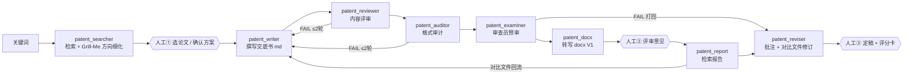

# 迁移部署指南 — auto_patent 专利流水线（可复制包）

本目录把整套工作流做成可复制资产：**5 个 skill 源 + 8 个 bot profile 骨架 + 一键部署脚本**。
新机器上：克隆仓库 → `python deploy/install.py --all` → 填 API Key → 重启桌面版，即可复刻同一套 8 Bot 流水线。

> 总纲文档（Bot 名册 / 4 个人工确认点 / 版本与复核规则 / 工具链）在
> `deploy/skills/patent/patent-workflow/SKILL.md`，部署后由 Hermes 以 skill 形式加载。

## 0. 包里有什么

| 路径 | 内容 | 部署目标 |
| --- | --- | --- |
| `deploy/skills/` | 5 个 skill 源 | `<HERMES_HOME>/skills/<category>/<name>/` |
| `deploy/profiles/<bot>/SOUL.md` | 8 个 bot 角色定义 | `<HERMES_HOME>/profiles/<bot>/SOUL.md` |
| `deploy/profiles/_skeleton/` | `profile.yaml`（Bot Mode 托管标记）、`.no-bundled-skills`、`.env`（注释模板）、`config.template.yaml`（脱敏） | 新 bot 目录骨架 |
| `deploy/install.py` | Hermes 侧部署/体检脚本（幂等） | — |
| `deploy/agent_install.py` | 把 5 个 skill 装到其他 AI Agent（Claude Code / Codex / WorkBuddy / CodeBuddy） | 见 `deploy/AGENT-INSTALL.md` |
| `deploy/AGENT-INSTALL.md` | 给 AI Agent 的安装指南（一键指令 + 路径表 + 验证 + 卸载） | — |
| `deploy/requirements-venv.txt` | `.venv_patent` 依赖清单 | 仓库根 `.venv_patent/` |

> `<HERMES_HOME>`：Windows 默认 `%LOCALAPPDATA%\hermes`；macOS / Linux 默认 `~/.hermes`。

5 个 skill 一览：

| skill | 用途 |
| --- | --- |
| `patent/patent-workflow` | **总纲**：8 Bot 名册、4 人工确认点、版本/复核规则、工具链索引 |
| `productivity/docx-from-markdown` | md→docx 转写（模板样式套用、Word 自动编号、OMML 公式） |
| `web/cn-patent-pdf-download` | 对比文件获取（CNIPA / drugfuture / 来源路由） |
| `autonomous-ai-agents/hermes-bot-orchestration` | Bot 调度（CLI 直投、托管标记、审查员预审闭环） |
| `autonomous-ai-agents/hermes-bot-fleet-config` | 多 profile 的 provider/model 同步 |

## 1. 前置条件

| 依赖 | 用途 | 备注 |
| --- | --- | --- |
| Hermes Agent（桌面版，含 `hermes` CLI） | Bot Mode 宿主 | v0.21.0 实测 |
| Python 3.10+ | 工具链 / 脚本 | 本机：3.13（`.venv_patent`）+ 3.11（playwright） |
| pandoc ≥ 3.x | LaTeX → Word 原生 OMML 公式 | 必须在 PATH |
| Node ≥ 18（含 npx） | mermaid-cli 出图 | 复用本机 Edge，无需另下 Chromium |
| Chrome 或 Edge | mermaid / CNIPA 爬虫共用 | 任一即可 |
| Microsoft Word（可选） | `docx_render_pdf.py`、页数统计 | 无则降级跳过 |
| 本地代理（可选，如 Clash 127.0.0.1:7897） | Google Patents 检索 | 端口改 `tools/patent_search.py` 顶部 |
| playwright（python 包） | `tools/crawl/` CNIPA 爬虫 | `pip install playwright`；本机已有 Chrome/Edge 时**无需** `playwright install` |

## 2. 部署（3 步）

```bash
git clone <repo-url> D:/auto_patent   # 建议就放 D:\auto_patent（技能与 SOUL 默认此路径）
cd D:/auto_patent
python deploy/install.py --check      # ① 体检：报告缺什么
python deploy/install.py --all        # ② venv + skills + bots（幂等，已存在的自动跳过）
```

单独使用：`--venv` / `--skills` / `--bots`；`--force` 覆盖已存在文件；`--hermes-home DIR` 指定 Hermes 配置目录。

### 其他 AI Agent（Claude Code / Codex / WorkBuddy / CodeBuddy 等）

非 Hermes 的 Agent 用独立安装器把 5 个 skill 装进各自技能目录（`~/.claude/skills`、`~/.agents/skills`、`~/.workbuddy/skills`、`~/.codebuddy/skills`）：

```bash
python deploy/agent_install.py --list   # 探测本机 Agent 与技能目录现状
python deploy/agent_install.py --all    # 安装到全部探测到的 Agent（幂等，可 --remove 卸载）
```

路径表、验证方法、卸载与「一键交给 Agent」的指令：**`deploy/AGENT-INSTALL.md`**。仓库根 `AGENTS.md`（通用规范）与 `CLAUDE.md` 由 Agent 打开仓库时自动读取。

## 3. 必做的手工步骤

1. **填 API Key**：`<HERMES_HOME>/profiles/patent_*/config.yaml` 中把 `<在此填入 …>` 替换为真实 Key；换 vendor/模型时，按 `hermes-bot-fleet-config` skill 从主配置整段同步 `custom_providers`。
2. **重启 Hermes 桌面版** → Bots 标签页应出现 8 个 bot（同一分组）。
3. **冒烟**：`hermes -p patent_writer chat -q "你是谁？用什么模型？"` —— 能自报模型即通。

## 4. 验证清单

- [ ] `python deploy/install.py --check` —— 无 `x` 项
- [ ] `hermes profile list` —— 8 个 `patent_*`
- [ ] 桌面版技能列表出现 `patent-workflow` 等 5 个 skill
- [ ] 出稿链路：`PYTHONPATH="" .venv_patent/Scripts/python.exe tools/md2docx.py <md> <out.docx>` 成功
- [ ] 校验链路：`… tools/verify_docx.py <out.docx>` 输出 12/12 章节匹配
- [ ] 检索链路：`python tools/crawl/cnipa_epub_search.py --type invention <关键词>` 有结果

## 5. 工作流总览（8 Bot + 4 人工确认点）



规则要点（细则见 patent-workflow skill）：评审/审计打回最多 2 轮；任何新版本（md vN+1 / docx V+1）必须重跑 reviewer + auditor 复核；结案出评分卡、不打包 zip；产物命名 `<发明名称>-交底书VN.docx`，旧版永不覆盖。

## 6. 不随包迁移的内容

| 项目 | 说明 |
| --- | --- |
| 各 bot 的会话/记忆/统计 | `sessions/`、`memories/`、`state.db`、缓存等留在原机器，按需手工拷贝 |
| API Key / 凭证 | 不入库（`config.template.yaml` 只有占位符） |
| 案件数据 `cases/` | 在 `.gitignore`；需要时从原机器整目录拷贝 |

## 7. 常见问题

| 现象 | 原因 / 处理 |
| --- | --- |
| bot 报「provider 无效」 | profile 缺 `custom_providers` → 按 hermes-bot-fleet-config 同步 |
| bot 收不到 @ 消息 / 无 `message_agent` | `profile.yaml` 缺 `ui_meta.hermes-bots` → 用骨架补（或桌面 New Agent 重建） |
| md2docx 公式变成图片 | pandoc 不在 PATH → 安装或加入 PATH |
| mermaid 报 Puppeteer 错误 | 缺 node/npx 或 Edge → 装其一；配置见 `tools/puppeteer-edge.json` |
| CNIPA 检索空/超时 | WAF 等待不足 → `EPUB_WAF_MAX_WAIT_SEC=60` 重试 |
| Google Patents 503 | 限流 → 改用 `tools/crawl/cnipa_epub_search.py` |
| 命令报 Hermes venv 污染 | 统一用 `PYTHONPATH="" .venv_patent/Scripts/python.exe`（Windows） |
| 仓库脱敏 | 公开仓库不放公司/个人信息；模板自备（`templates/README.md`）；提交前跑 `python deploy/privacy_check.py` |

## 8. 本机已验证环境（2026-09-10）

Windows 11 · Hermes v0.21.0 · Python 3.13（`.venv_patent`）+ 3.11（playwright 1.62）· pandoc 3.8 · Node v22 · Edge / Chrome · Word 2016+。
`python deploy/install.py --check` 全项通过；md → docx → 校验全链路实测可用。
