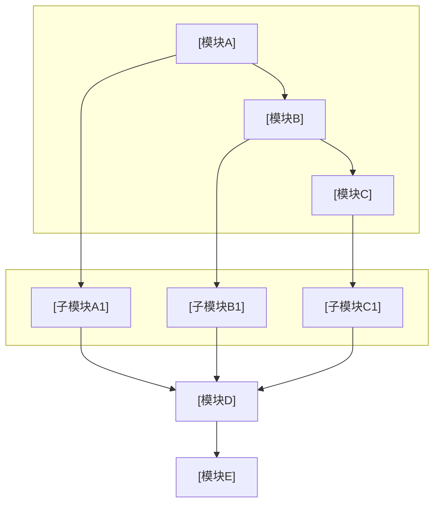
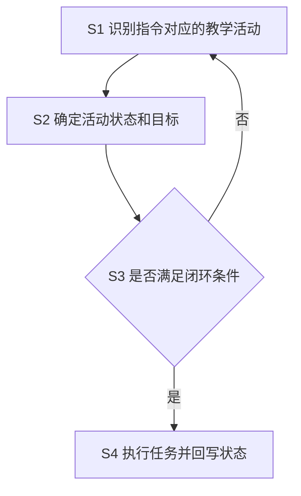

# 专利交底书模版参考（脱敏版）

本文档为技术交底书格式与章节要点参考，内容已脱敏，适用于多领域专利撰写。由 `disclosure_builder.md` 引用。

---

## 文档头部

```markdown
# 技术交底书

**案件名称**：[待填写]一种XXX方法及系统

**技术联系人**：
- 姓名：[待填写]
- 电话：[待填写]
- 邮箱：[待填写]

**专利类型**：发明

---

## 注意事项

（1）交底书应使代理人能看懂，尤其是背景技术和详细技术方案，一定要写得全面、清楚、完整；
（2）技术的公开程度，应以本领域普通技术人员不需付出创造性劳动即可进行实施为准。
（3）在与代理人沟通时，对于代理人咨询的技术问题，应给予回答并认真讲解，并且按要求及时正确地补充相应技术材料。
```

在用户产出目录保存时，**`.md` / `.docx` 主文件名**应为 **`{案件名称规范化}_{YYYYMMDDHHmmss}`**（占位去掉、非法字符、过长截断及时间戳规则见 `disclosure_builder.md` **§7.3**，**凡交付均须时间戳**），避免与标题无关的固定名。

---

## 一、技术背景与现有技术

### 1.1 现有技术

- 检索渠道、链接格式与禁止事项以 Step 5 **`prior_art_search.md`** 为准（不在此重复）。
- **检索说明**（建议置于 1.1 开头）：写**公开数据库名称**与**检索词**；**勿**写 `cnipa_epub_search.py` 等脚本名或「查新降级」等流程用语（见 **`prior_art_search.md`「1.1 检索说明写法」**）
- 按**技术方向**分类列举（如：单标签方法、多标签方法、聚类策略等）
- 每条现有技术需包含：专利号 / 文献标识、申请方（或来源机构）、技术方案、应用场景、**局限性**、**公开源 URL（必填）**
  - **国知局 `abstract`**：若 Step 5 JSON 含 **`abstract`**，该条「技术方案」等叙述**必须先充分理解摘要后**再概括（见 **`prior_art_search.md`**）；交底书正文勿大段粘贴官方摘要全文。
  - **URL 要求**：与 `prior_art_search.md` 一致——每条**至少一个**可公开访问链接，**写入前验证**有效且与著录项一致；**禁止虚构链接**。
  - **正文呈现建议**：在每条方向下可用「**来源链接**：…」单独一行，或表格增列「链接」。
- 结尾总结：检索总结、**本发明与现有技术的本质区别**

### 1.2 现有技术存在的缺点

- 分点列举，与 1.1 的局限性呼应
- 突出**核心缺陷**：现有技术无法解决的问题

---

## 二、本发明所要解决的技术问题

- 对应一中的缺点，逐条说明本发明的解决思路
- 简明扼要，为第三章详细方案做铺垫

---

## 三、技术方案详细阐述

### 3.1 背景

**成文顺序固定为三小段**（不另开章；与 **`disclosure_builder.md` §7.9** 一致）：

1. **场景与参与者**：用**案件名称里的领域对象**称呼执行主体（脱敏公司名，但不抽掉标题对象）。写清谁在什么项目/环境里协同或处理什么。
2. **标题对象如何进入系统**：该对象如何被配置、选择、调度或进入执行。**只写本案材料里有的机制**；材料没有则不要套用其它案件的配置方式。
3. **高频术语的场景定义**：后文将反复出现的**领域词**各用一句人话定义（需要时加「如何判定/如何记录」）。定义后全文同词。不要给与话题不符的行话做定义来保留它。

| ✅ 要做（领域词当正文术语） | ❌ 避免（话题错位的抽象行话当术语） |
|------|--------|
| 岗位协同：项目资料版本、实际使用资料清单、变更记录序号、候选交付物版本 | 指纹、水位、事件账本、输出命名空间 |
| 数字教师：教学资料与学习反馈记录、重复执行控制规则、初始教学资料清单 | 学习证据账本、幂等标识、输入证据范围 |
| 家庭回忆：来源记录、画面相似特征、代表媒体、事件资料记录、版本历史 | 指纹、媒体锚点、事件证据库、版本账本 |
| 标题有「数字员工」则 3.1 写清它是什么、如何进入执行 | 标题有该对象，3.1 只写「岗位任务/智能体集群」 |

上表是**错位模式**的对照，不是禁词表。成文时用本案标题做同样检查：代理人只看标题和场景，会不会觉得这些词属于另一技术领域？会，就换成本领域说法。

**不要**：把「岗位技能包」等某一案的配置写成所有发明的必写模块。

应用场景仍须脱敏（分类 A/B、场景 X）；有人工环节时说明前提。

### 3.2 系统框图

- 使用 **fenced mermaid**（推荐 `flowchart TB` / `LR` + `subgraph` 分层）。
- **节点名用标题领域对象与场景短词**；避免公司名、产品名、内部代号。
- **禁止**为「抽象通用」把标题对象换成更空的上位词（「数字员工」→「岗位集群」；「资源画像」→「节点数据」）。实现字段不要堆进标签。
- 定稿交付前经 **`tools/mermaid_render.py`** 转为 PNG 并**默认**生成 Word；**不需要**再附 ASCII 文字框图（Word 中以图为准）
- 布局宜层次清晰；复杂时可拆多张 mermaid 图

**mermaid 系统框图模版**（替换标题与模块名、连线；与 3.4 相同为 `` ```mermaid`` 围栏）：



### 3.3 模块功能说明

**重点**：各模块的**作用**和**模块间关联关系**，专利不强调输入输出。

- 作用：该模块在整体方案中的角色
- 关联关系：上下游依赖、数据流/控制流、闭环关系
- 模块名、执行主体、资料/交付物名称与 **3.1 / 3.2** 同词，且属于本专利话题；不要把另一领域的行话当模块术语。
- **一模块一项**：3.3 按框图节点拆成独立条目（作用 + 关联），不要把多个框图节点揉进一条。

### 3.4 系统流程说明

#### 流程图

- 使用 **fenced mermaid** 代码块；**不要** ASCII 文字/箭头流程图。
- 定稿交付前用仓库 **`tools/mermaid_render.py`**（Playwright + 内置 mermaid.js）转为 PNG 并**默认**生成 Word；失败时按终端提示用 **`md_to_docx.py`** 手动转换。
- **可见步骤号**：id 不出图，标签里要写出 S1/S2。正例：`S1["S1 采集节点指标"] --> S2["S2 滑动平滑生成画像"]`。反例：`S1[识别教师指令对应的教学活动]`（PNG 没有 S1）。判断节点同理：`S5{"S5 是否达阈"}`。
- 步骤标签用**标题领域对象与场景短词**（与 3.2 同一套名字），不要换成更空的上位词。

**mermaid 流程图模版**（替换步骤名；id 与标签均含序号）：



#### 流程说明

- 用文字**按步骤号逐项**说明 S1—Sn（与图中节点一一对应，**不替代**流程图图示）。步骤里须让**标题领域对象做事**，不能只在 3.1 出现一次，也不能几步合并成一段而不点步骤号。
- 术语与 3.1 领域词同词；需要强调如何判定时，括号内写白话机制，仍不要改回错位行话。
- 流程涉及算法、评分、约束或形式化变量时，在 **3.4.1** 集中给出符号定义与主公式；须先完成 **`formula_plan.yaml`**（材料式 `origin: source` 保真；无原文才从 `paradigms.yaml` 起草），并遵守 **`disclosure_builder.md` §7.7**

### 3.4.1 符号与公式

**撰写顺序**：**`formula_plan.yaml`（材料勾选 + 来源标记；缺口才起草）** → 符号与变量定义 → 核心公式（含式 (1)）→ 文字解释与流程衔接。

材料没有对应式时，列出可用范式：`python tools/formula_paradigms.py list`。组合示例见配置中 `combos`（如 `match_then_rate_limit`）。

#### 符号表示例（Markdown 正文可直接采用）

```markdown
#### （1）任务侧符号

| 符号 | 含义 | 下标/量纲 |
|------|------|-----------|
| \(i\) | 任务索引 | \(i=1,\ldots,N\) |
| \(b_{i,\mathrm{cpu}}\) | 任务 \(i\) 的 CPU 需求权重 | 无量纲，\(b_{i,\mathrm{cpu}}>0\) |
| \(b_{i,\mathrm{mem}}\) | 任务 \(i\) 的内存需求权重 | 同上 |

#### （2）节点侧符号

| 符号 | 含义 | 下标/量纲 |
|------|------|-----------|
| \(j\) | 计算节点索引 | \(j=1,\ldots,M\) |
| \(A_{j,\mathrm{cpu}}\) | 节点 \(j\) 平滑后的 CPU 可用比例 | \([0,1]\)（由原始 \(a\) 经滑动平均得到，**不用** \(\tilde{a}\)） |
```

#### 公式正/反例（体例必遵）

| 场景 | ✅ 推荐 | ❌ 避免 |
|------|---------|---------|
| CPU 维度权重 | \(b_{i,\mathrm{cpu}}\) | \(b_i^{cpu}\)（上标易被读作幂次） |
| 平滑画像 | \(A_{j,\mathrm{cpu}}\) + 文字说明 | \(\tilde{a}_{j,\mathrm{cpu}}\)（装饰音，Word 易渲怪） |
| 节点可用 | \(A_{j,\mathrm{cpu}} \le 0\) 不可派发等 | \(a_j^{cpu} \le 0\) |
| 多维度并列 | \(b_{i,\mathrm{cpu}},\, b_{i,\mathrm{mem}}\) | \(b_i^{cpu}, b_i^{mem}\) |
| 选题 | 材料已有式：`origin: source` 转录 | 把材料公式改写成库内 `weighted_sum` 等模板 |
| 无原文时起草 | 范式库 `weighted_sum_unit` + `dual_threshold` | 未登记的巨型单式、量纲混乱硬凑 |
| 块级主公式 | `\[ s_{ij} = \alpha x + \beta y - \lambda n \tag{1} \]` 单行 | 块内多行 `\\` 换行堆叠（渲染易失败） |
| 逻辑连接 | 公式外写「且 \(A_{j,\mathrm{mem}}\le 0\)」 | 公式内 `\text{且}` |
| 防零除 | \(\max(\varepsilon, b_{\mathrm{mem}})\)，\(\varepsilon\) 同量纲 | \(\max(1, b_{\mathrm{mem}})\) 且 \(b\) 为 MB |
| 行内分隔符 | ``\(M_{\mathrm{total}}\)`` 或 ``$M_{\mathrm{total}}$`` | ``(M_{\mathrm{total}})``（普通括号；预览里 `\(` 像 `(`，勿删反斜杠；Word 当纯文本） |

**行内/块级分隔符**：全文统一 `\(...\)` / `\[...\]` **或** `$...$` / `$$...$$` 二选一；与 **`disclosure_builder.md` §7.7** 一致。Word 只从**当次时间戳定稿 md**转出；改正分隔符后须重跑定稿脚本。

### 3.5 关键技术参数

- 置信度/阈值类：含义、取值范围
- 算法参数：公式、约束条件
- 参数表须设 **「符号」列**，与 **3.4.1 符号表逐字同形**（勿在 3.5 改用 `^{cpu}` 而上文用下标）
- 表内中文参数名与 **3.1 领域术语**同词；需要写清判定时用「领域名（如何判定/如何记录）」，不要另起一套与话题不符的行话
- 确保与正文公式、实施例数值一致

---

## 四、与现有技术相比的优点

- 先概括性观点，再分点详述
- 与第二章解决的问题、第五章保护点呼应；用语与 3.1 场景术语同词
- 技术细节以第三章为准，本章以论点为主

---

## 五、技术关键点和欲保护点

- 列出核心创新点，每点简明定义；**可以**使用 3.1 的场景词。
- 每条仍须是**可实施机制**（对什么输入、如何判定或控制、得到什么输出），详细技术方案引用第三章。
- **禁止**把保护点写成仅有角色枚举（如「有三个数字员工」）或只复述标题对象名称。
- 避免与第三章重复大段技术细节。

---

## 六、其它

### 实施例

- **2～3 个有名字的实例**，名称与 3.1 / 3.2 相同；各写清职责、可调用能力、交付物、相互依赖。
- 走完**主路径**，并至少写清**一条第三章已有的分支**（变更/中断/冲突/限频等，以本案为准）。
- 应用场景脱敏（公司名、真实数值）；实例本身要具体，不要只压缩复述 3.4。
- **技术效果**：量化或定性说明。
- **参数设置示例**：注明「不作为权利要求限制」；有公式时与 3.5 / `formula_plan.numeric_example` 一致。

---

## 脱敏检查表

| 检查项 | 脱敏方式 |
|--------|----------|
| 公司/产品名、内部代号 | 删除或「某系统」 |
| 不宜公开的精确数值 | 「一定规模」「预设值」 |
| 具体分类标签（非标题对象） | 分类A、分类B、分类C 等 |
| **标题领域对象、实施例角色与交付物类型** | **不脱敏抽掉**；只去掉真实主体名 |

---

## 标题贯穿与术语检查（成文时对照）

- 案件名称中的领域实词，能否在 **3.2、3.4、第六章**指到同一个执行主体？
- 离开本案标题与 3.1 场景，3.3 / 3.5 / 第五章的用词会不会像另一技术领域？若会，整族换成领域表述，不要靠补定义保留。
- 换过术语的，1.1 至第六章及 mermaid 是否已整族替换？

---

## 交付正文禁忌（勿写入交底书）

- **禁止**在全文任意位置（尤其**文末**）加入技能仓库、示例仓库、`patent-disclosure-skill`、`examples/` 路径、「教学/虚构示例」「不构成法律或技术承诺」等**元脚注**；交付物视为正式技术交底书文稿，**止于业务章节**。

## 公式与参数一致性检查

- 全文公式表述统一（如：置信度权重、密度调整系数）
- **选题**：材料已有公式进 `formula_plan` 且 `origin: source` 可对上出处；无原文的式才来自 `paradigms.yaml`；案件有 `formula_plan.yaml`
- **符号体例**：资源维度用下标 `_{\mathrm{cpu}}` 等，**无** `^{cpu}`/`^{mem}` 类上标维度写法；**无** `\tilde`/`\hat`/`\bar` 装饰音
- **符号表完整**：3.4.1 已定义符号；式 (1) 及后文每个符号均在表中出现；**无**同一字母多义
- **公式正确性与逻辑**：各式无笔误；不等式方向与文字一致；公式与 3.4 流程/3.3 模块可互推；边界情形不矛盾；量纲可加
- **跨节同形**：3.4.1、3.5「符号」列、第六章实施例与正文公式 **逐字一致**
- 阈值范围一致（如 0.5–1.5、0.8–1.2）
- 参数命名统一（避免同义不同名混用）
- LaTeX 分隔符全文统一（`\(...\)`/`\[...\]` 或 `$`/`$$` 二选一）；**无** `(M_{\mathrm{…}})` 这类普通括号包 LaTeX；`latex_delimiters.py` 无 hits
- 实施例数值与 3.5 节及 `formula_plan.numeric_example` 对应
